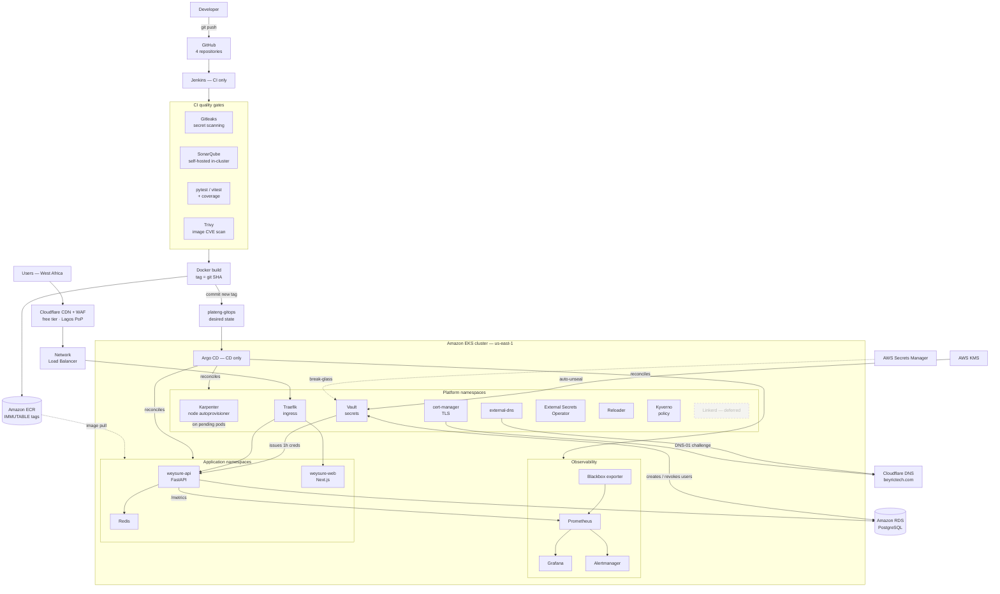
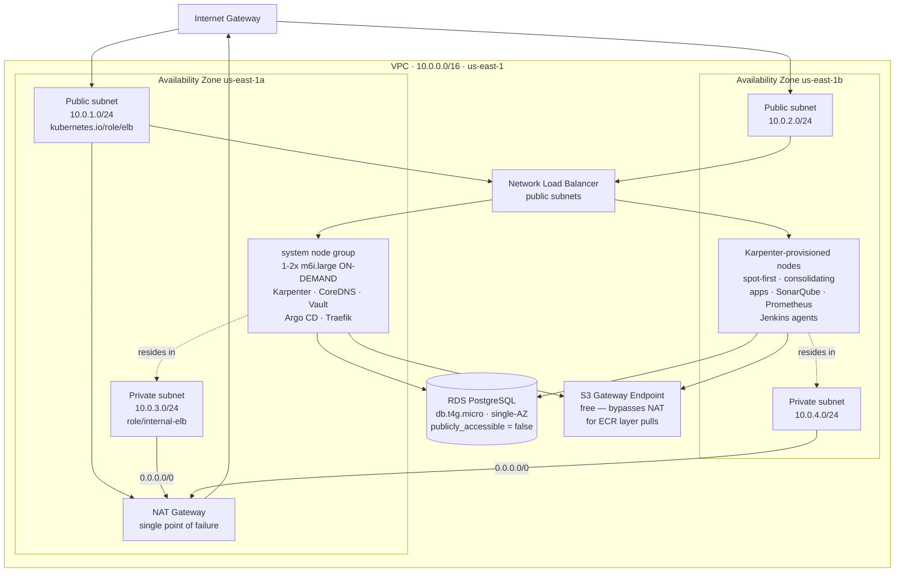
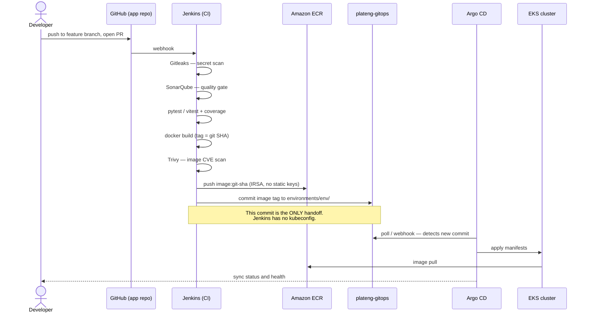
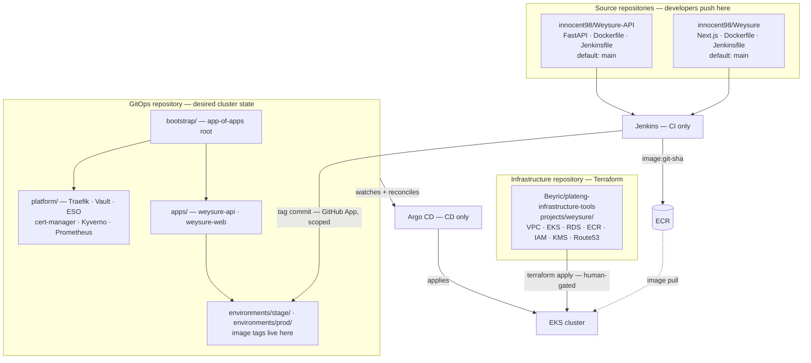
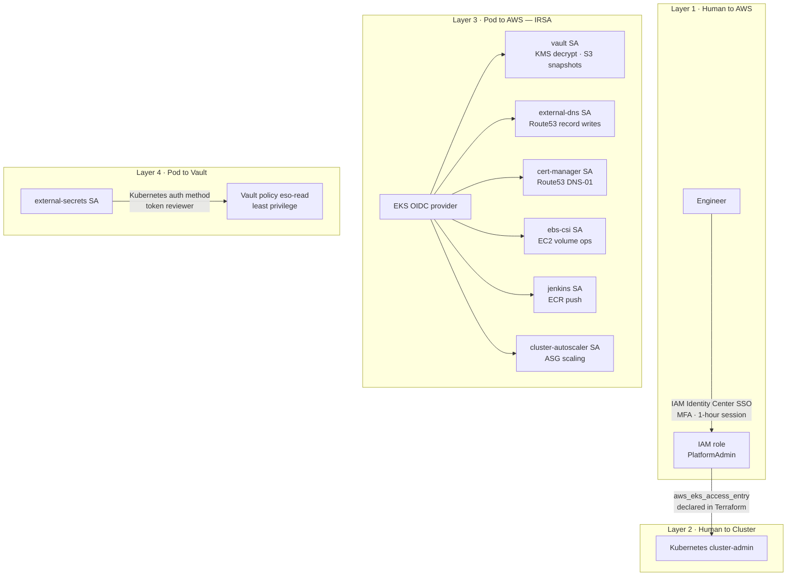
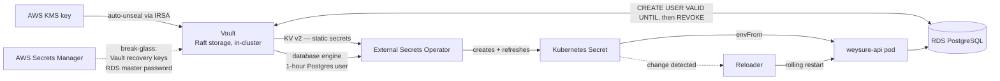
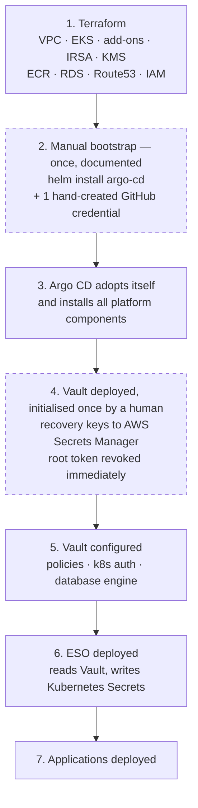
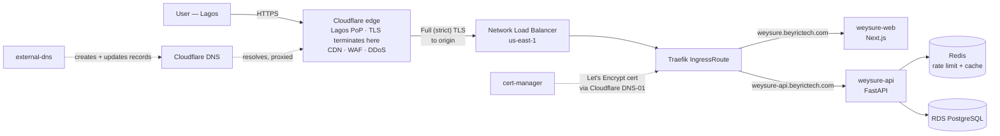
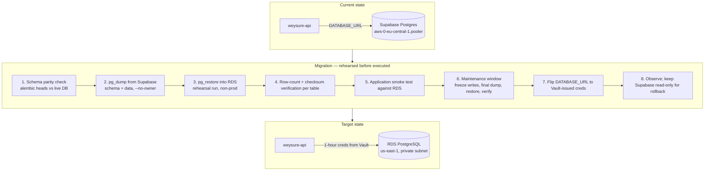
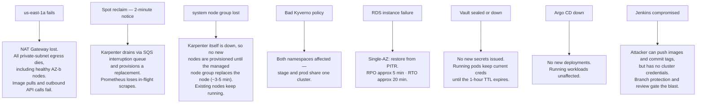

# Weysure Platform — Architecture

> **Status:** Design (pre-implementation). No AWS resources exist yet.
> **Last updated:** 2026-08-26
> **Companion documents:** [Design spec](../specs/2026-08-26-weysure-platform-design.md) · [Build checklist](../checklist/BUILD_CHECKLIST.md) · [Decision records](../../memory/DECISIONS.md)

All diagrams are Mermaid, rendered natively by GitHub. They are the **source of truth for
intent**. When implementation diverges from a diagram, the diagram is updated in the same
pull request — a diagram that lies is worse than no diagram.

## Contents

| # | Diagram | Answers |
|---|---|---|
| [1](#1-target-state) | Target state | What are we building, end to end? |
| [2](#2-aws-network-topology) | AWS network topology | Where does everything physically sit? |
| [3](#3-cicd-flow) | CI/CD flow | How does code become a running pod? |
| [4](#4-repository--gitops-topology) | Repository & GitOps topology | Which repo owns what? |
| [5](#5-identity-layers) | Identity layers | Who is allowed to do what? |
| [6](#6-secrets-flow) | Secrets flow | How does a credential reach a pod? |
| [7](#7-bootstrap-ordering) | Bootstrap ordering | What must exist before what? |
| [8](#8-request-path) | Request path | How does a user's request reach the app? |
| [9](#9-database-migration-path) | Database migration | How do we get off Supabase? |
| [10](#10-failure-modes--blast-radius) | Failure modes | What breaks, and what does it take with it? |

---

## 1. Target state

The complete platform. Components in **dashed** boxes are deliberately deferred — see
[Deferred scope](#deferred-scope).



### Deferred scope

| Component | Why deferred | Revisit trigger |
|---|---|---|
| **Linkerd** | ~50m CPU / ~50 MiB sidecar on *every* pod ≈ 40% of the on-demand node | Node capacity increase, or first service-to-service traffic worth encrypting |
| **CloudFront** | Superseded — Cloudflare's free plan gives an equal or better edge at zero cost | Only if leaving Cloudflare |
| **Multi-AZ NAT** | +$33/mo | Budget increase, or first AZ-related incident |
| **Multi-AZ RDS** | Doubles instance cost | First paying-customer SLA |
| **Second cluster** | +$73/mo control plane + nodes | First time stage causes a prod incident |

---

## 2. AWS network topology



**Design notes**

- Worker nodes live **only in private subnets**. Nothing in the cluster is directly
  internet-reachable; ingress is exclusively via the NLB in public subnets.
- The RDS security group permits `5432` **only from the VPC CIDR**, and
  `publicly_accessible = false`.
- The **S3 Gateway Endpoint is free** and removes NAT data-processing charges for ECR layer
  pulls, which are the dominant NAT traffic in a Kubernetes cluster.
- **Both private subnets route through one NAT Gateway in `us-east-1a`.** An AZ-a failure
  removes egress for AZ-b nodes too. Accepted, documented, and on the revisit list.

---

## 3. CI/CD flow

The single most important property: **Jenkins holds no cluster credentials.** Its entire
relationship with the cluster is one git commit.



**Rollback is `git revert` on `plateng-gitops`.** Argo CD reconciles back to the previous
image tag. There is no separate rollback tool and no judgement call.

---

## 4. Repository & GitOps topology



### Why four repositories

The rule everything follows from: **the repository Argo CD watches must not be the
repository developers push application code to.** If they are the same repo:

1. CI commits an image tag, which triggers CI, which commits again. Infinite loop.
2. Every application commit becomes a potential production deploy.
3. You lose the audit distinction between *built* and *deployed* — the exact question asked
   during an incident.

**Terraform is deliberately not watched by Argo CD.** Argo CD reconciles Kubernetes objects;
cloud resources stay in Terraform behind a human-gated `apply`. Blurring that line invites
"Argo CD deleted our RDS instance."

### Multi-project layout

Both platform repos are named `plateng-*` rather than `weysure-*`, so `weysure` is a scoped
subtree and a second product drops in without restructuring:

```text
plateng-infrastructure-tools/          plateng-gitops/
├── modules/            (shared)       ├── bootstrap/
│   ├── vpc/                           ├── platform/         (shared)
│   ├── eks/                           └── projects/
│   └── rds/                               └── weysure/
└── projects/                                  ├── apps/
    └── weysure/                               └── environments/
        ├── main.tf                                ├── stage/
        └── terraform.tfvars                       └── prod/
```

---

## 5. Identity layers

Secrets management without identity is just a nicer place to keep the same static
credential. Identity is designed first.



**Application pods hold no AWS identity.** They receive database credentials from Vault, not
from AWS, so there is nothing for them to assume and nothing to leak.

**Jenkins pushes to ECR via IRSA** — no AWS access keys exist anywhere in the pipeline.

---

## 6. Secrets flow



### Secrets inventory

| Class | Keys | Home | Lifetime |
|---|---|---|---|
| **Dynamic** | Postgres username + password | Vault database engine | **1 hour**, auto-revoked |
| **Static app** | `SECRET_KEY`, `PAYSTACK_*`, `CLOUDINARY_*`, `SMTP_*`, webhook secrets | Vault KV v2 | scheduled rotation |
| **Platform** | GitHub App private key, Argo CD admin, Grafana admin | Vault KV v2 | scheduled rotation |
| **Break-glass** | Vault recovery keys, RDS master password | AWS Secrets Manager | never stored in Vault |
| **Not secret** | `PROJECT_NAME`, `API_V1_STR`, `ENVIRONMENT`, `BACKEND_CORS_ORIGINS`, `WEB_CONCURRENCY`, reconciliation intervals | ConfigMap, in git | reviewable in PRs |

Roughly a third of the current `.env` is **not secret**. Moving it to a ConfigMap makes it
diffable in pull requests and removes it from the blast radius. Treating an entire `.env` as
one opaque secret is the most common secrets-management mistake.

### Why External Secrets Operator rather than Vault Secrets Operator

`ExternalSecret` manifests describe *what secret is wanted*, not *where it lives*. Swapping
Vault for AWS Secrets Manager later changes **one** `SecretStore` resource; every application
manifest is untouched. VSO couples every manifest to Vault.

### Why Vault rather than AWS Secrets Manager alone

The deciding factor is **dynamic database credentials**, which Secrets Manager cannot
provide. Vault's database engine means there is **no standing database password** for the
application — not in git, not in Terraform state, not in a Kubernetes Secret, not in an
environment variable that outlives an hour.

---

## 7. Bootstrap ordering

Every secrets system has a bootstrap secret. The question is never *"can we eliminate it?"*
but *"how few are there, who knows they exist, and are they written down?"*



**Two manual gates, both deliberate:**

| Gate | Why it cannot be automated | Mitigation |
|---|---|---|
| 2 — Argo CD's git credential | Vault is installed *by* Argo CD | Documented runbook; **rotated immediately** once Vault is live |
| 4 — Vault initialisation | Vault cannot store its own recovery keys | Recovery keys to AWS Secrets Manager; root token revoked after break-glass admin exists |

---

## 8. Request path



### DNS and domain

| Item | Value |
|---|---|
| Apex domain | `beyrictech.com` |
| Registrar | Namecheap |
| Authoritative DNS | **Cloudflare** (nameservers delegated from Namecheap) |
| Production frontend | `weysure.beyrictech.com` |
| Production API | `weysure-api.beyrictech.com` |
| Staging frontend | `weysure-stage.beyrictech.com` |
| Staging API | `weysure-api-stage.beyrictech.com` |

**Route 53 is not used.** Because DNS is delegated to Cloudflare, both `external-dns` and
`cert-manager` use the Cloudflare provider with a scoped API token (stored in Vault), rather
than Route 53 with IRSA. This removes one IRSA role and the hosted-zone charge.

### Latency mitigation for `us-east-1`

`us-east-1` is roughly 140–180 ms from Lagos versus roughly 95 ms from Frankfurt
([ADR-002](../../memory/DECISIONS.md)). Cloudflare's free plan mitigates this **better than
CloudFront would, at zero cost** ([ADR-011](../../memory/DECISIONS.md)):

- **TLS terminates at Cloudflare's Lagos PoP**, so the expensive handshake never crosses the
  Atlantic. The remaining hop travels Cloudflare's backbone rather than the public internet.
- **Static assets cached at the edge** — most of a Next.js page load never reaches AWS.
- **The NLB is never exposed publicly**; its security group admits only Cloudflare's published
  IP ranges. This is a security gain, not only a performance one.
- **Redis for hot reads** keeps escrow and wallet flows off unnecessary round trips.

Origin TLS uses Cloudflare **Full (strict)** mode against a real Let's Encrypt certificate
issued by cert-manager — not Flexible, which would leave the AWS-side leg unencrypted.

---

## 9. Database migration path

The application currently runs on Supabase Postgres in `eu-central-1`. Investigation
confirmed this is a **pure data migration** — authentication is already self-hosted
(`passlib` bcrypt in `app/core/security.py`, `hashed_password` on the local `users` table).



**Why a maintenance window rather than logical replication:** source and target are in
different regions (`eu-central-1` to `us-east-1`), so cross-region logical replication would
run over the public internet — fragile, and hard to reason about under load.

**Rollback:** Supabase is left intact and read-only until the new database has been observed
healthy through a full business cycle. Reverting is a `DATABASE_URL` change.

### Residual Supabase coupling to remove

| Location | Issue | Status |
|---|---|---|
| `app/core/supabase.py` | Entire module — never imported anywhere (`grep 'from app.core.supabase'` returns 0 files) | Dead; delete |
| `app/services/user_service.py:45` | Filters on `User.supabase_id`, a column dropped by migration `9090aa00a81c` | Broken; delete |
| `app/services/user_service.py:96` | Calls `supabase_client`, which is not imported in that file | Broken; delete |
| `app/api/v1/endpoints/admin.py:176` | `_get_supabase().auth.admin.delete_user(...)` — **1 residual live call site**, passing a local ID to an API that no longer knows these users | Broken; delete |
| `pyproject.toml` / `requirements.txt` | `supabase==2.15.2` dependency | Remove after the above |

---

## 10. Failure modes & blast radius

Accepted weaknesses, stated plainly. A Well-Architected review that finds nothing is a review
that was not done.



| Failure | Mitigation in place | Accepted gap | Revisit trigger |
|---|---|---|---|
| AZ-a outage | Nodes span 2 AZs | **Single NAT = shared egress SPOF** | Budget increase, or first AZ incident |
| Spot reclaim | Karpenter SQS interruption handling, PDBs, on-demand system node group | Prometheus scrape gaps | Node capacity increase |
| **Karpenter unavailable** | Managed node group replaces the system node automatically; running nodes unaffected | ~3–5 min with no new node provisioning | Second system node (min_size = 2) |
| Cluster-wide policy error | Separate Argo CD projects, ResourceQuota, NetworkPolicy | **stage and prod share a cluster** | First stage-caused prod incident |
| RDS failure | Automated backups + PITR, **restore rehearsed** | Single-AZ | First paying-customer SLA |
| Vault outage | KMS auto-unseal removes the manual-unseal outage class | Single replica | Node capacity increase to 3-replica Raft HA |
| Argo CD outage | Stateless; workloads keep running | — | — |
| CI compromise | **Zero cluster credentials**, IRSA-scoped ECR push, branch protection | — | — |
