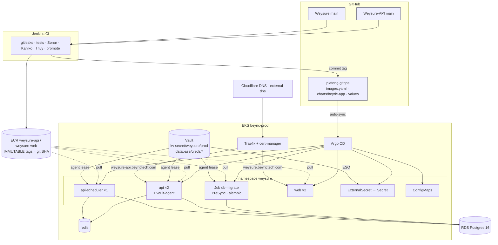

# Phase 7 — Application delivery architecture

```mermaid
flowchart TB
  subgraph gh[GitHub]
    API[Weysure-API main]:::repo
    WEB[Weysure main]:::repo
    GO[plateng-gitops<br/>images.yaml · charts/beyric-app · values]:::repo
  end
  subgraph ci[Jenkins CI]
    J[gitleaks · tests · Sonar · Kaniko · Trivy · promote]
  end
  ECR[(ECR weysure-api / weysure-web<br/>IMMUTABLE tags = git SHA)]
  API --> J --> ECR
  WEB --> J
  J -->|commit tag| GO
  subgraph eks[EKS beyric-prod]
    ARGO[Argo CD]
    subgraph ns[namespace weysure]
      MIG[Job db-migrate<br/>PreSync · alembic]
      A1[api ×2<br/>+ vault-agent]
      SCH[api-scheduler ×1]
      W1[web ×2]
      ES[ExternalSecret → Secret]
      CM[ConfigMaps]
    end
    V[(Vault<br/>kv secret/weysure/prod<br/>database/creds/*)]
    R[(redis)]
    T[Traefik + cert-manager]
  end
  RDS[(RDS Postgres 16)]
  CF[Cloudflare DNS · external-dns]
  GO -->|auto-sync| ARGO --> MIG & A1 & SCH & W1 & ES & CM
  ECR -.pull.-> A1 & SCH & W1 & MIG
  V -->|ESO| ES
  V -->|agent lease| A1 & SCH & MIG
  MIG --> RDS
  A1 & SCH --> RDS
  A1 & SCH --> R
  T -->|weysure-api.beyrictech.com| A1
  T -->|weysure.beyrictech.com| W1
  CF --> T
  classDef repo fill:#eef,stroke:#446
```

Read with [the Phase 7 spec](../specs/2026-09-10-phase-7-app-delivery.md).
