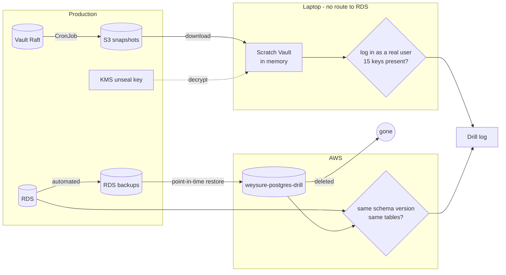

# Runbook — restore drill (Vault and RDS)

**A backup that has never been restored is a hope.** The drill proves, with a timer running, that
the two stores of state that cannot be rebuilt from git can be brought back.

| | Vault | RDS |
|---|---|---|
| Backup | Raft snapshot, daily 02:00 UTC + before every sleep → S3, 30 days | Automated backups + transaction logs, 7 days |
| RPO (data you can lose) | up to 24 h | ~5 min (measured 4 min 21 s) |
| Drill script | `scripts/drill-vault-restore.sh` | `scripts/drill-rds-restore.sh` |
| Where it runs | **your laptop**, Docker | a second RDS instance + a Job in the cluster |
| Duration | ~1 min (measured 41 s) | ~25 min (measured 17 min; data verified after 13) |
| Cost | none | a few cents |
| Touches production | reads one S3 object, uses the KMS key | reads backups; read-only queries |

**When:** once now, then quarterly (first week of January, April, July, October), and after any
change to Vault's seal, the snapshot CronJob, or the RDS backup settings.



## Part 1 — Vault

Needs: Docker Desktop running, `aws sso login`, your Vault password.
```bash
~/Documents/beyric/projects/plateng-infra/plateng-infrastructure-tools/scripts/drill-vault-restore.sh
```
It prompts once for your **production** Vault password (not shown). Logging in with a production
user against the restored copy is part of the proof: the users came back too.

| Step | Proves |
|---|---|
| 1 Download newest snapshot | It exists, is readable, and how old it is (= RPO) |
| 2–3 Start and initialise a scratch Vault | — |
| 4 Restore, wait for unseal | **The KMS key decrypts the snapshot.** This is the step that fails if the key is lost. |
| 5 Log in as `adebayo` | Auth methods and users are in the snapshot |
| 6 Read `secret/weysure/prod` | Secrets are in the snapshot: 15 keys expected. Names and counts only are printed. |

**Pass:** the last lines read `PASS  Vault restore drill` with the RPO and the duration.

### Why on the laptop and not in the cluster
A restored Vault is a running clone of production. It holds the lease table and the database
engine's connection. It would see leases as expired and run `DROP ROLE` against the production
database — for credentials the real Vault has since renewed and the API is using. On the laptop it
has no route to the private subnets, the RDS hostname is pointed at `127.0.0.1` as well, the data
lives in memory, and the container is removed on exit.
**Never restore a snapshot into a second Vault that can reach RDS.**

## Part 2 — RDS

Needs: `aws sso login`, kubectl on `beyric-prod`, the platform awake.
```bash
~/Documents/beyric/projects/plateng-infra/plateng-infrastructure-tools/scripts/drill-rds-restore.sh
```
Type `drill` to confirm.

| Step | What |
|---|---|
| 1 | Reads production's settings and its latest restorable time (= RPO) |
| 2 | Point-in-time restore to a **new** instance `weysure-postgres-drill`: same class, subnets, security group; private; tagged `purpose=restore-drill` |
| 3 | Waits until available (~15–20 min) |
| 4 | A Job in `weysure-prod` connects to both, read-only, and compares schema version, table list, roles and row counts |
| 5 | Deletes the drill instance — only if it carries the tag, only if the comparison passed |
| 6 | Prints RPO and RTO |

**Pass:** same schema version, same tables, same roles. Row counts may differ by what was written
after the restore point; the differences are listed.
**On failure the drill instance is kept** for investigation and the delete command is printed. It
costs about $0.50 a day — do not forget it.
If the script is interrupted, run it again: it finds the instance and continues.

The schema version is read from the `alembic_version` table — the same value `alembic current`
prints, without needing the application image.

## What the drill does not prove
| Not proven | Why | Covered by |
|---|---|---|
| Restoring Vault **in the cluster** | Too dangerous to rehearse beside the live Vault (above) | Procedure below; steps 2–4 are the same commands the drill runs |
| Switching the application to a restored database | Needs downtime | Procedure below — **not rehearsed**; rehearse before go-live |
| Loss of the KMS key | Not recoverable: every snapshot becomes unreadable | Prevention only: deletion alarm (EventBridge → SNS), 30-day deletion window |
| Loss of the whole AWS account or region | Out of scope (spec §8) | — |

## Real recovery — Vault volume lost  *(not rehearsed in the cluster)*
1. Confirm: `kubectl get pvc,pod -n vault`; `kubectl logs vault-0 -n vault | tail`.
2. Give Vault an empty volume: `kubectl delete pvc data-vault-0 -n vault` then `kubectl delete pod vault-0 -n vault`.
   **Only when the data is certainly gone** — this is the point of no return for anything newer than the snapshot.
3. `kubectl exec -n vault vault-0 -- vault operator init -recovery-shares=1 -recovery-threshold=1`
   — these keys are throw-away; the restore replaces them with the original ones.
4. Download the newest snapshot, `kubectl cp` it into the pod, then with the token from step 3:
   `vault operator raft snapshot restore -force /tmp/vault.snap`.
5. `vault status` → unsealed. Log in with your normal user.
6. `kubectl rollout restart deploy/external-secrets -n external-secrets`, then restart `api` and
   `api-scheduler` so they take fresh database credentials.
7. Expect Vault to revoke leases that expired in the meantime. Here that is correct.

## Real recovery — database lost or corrupted  *(outline, not rehearsed)*
1. Stop writes: scale `api` and `api-scheduler` to 0 (pause Argo first — [SLEEP_WAKE.md](SLEEP_WAKE.md)).
2. Choose the time. Corruption: just **before** it happened (`--restore-time`). Loss: latest.
3. Restore to `weysure-postgres-restored`; verify with the comparison Job.
4. Rename old → `weysure-postgres-old`, restored → `weysure-postgres`. The endpoint name stays the
   same, so Vault's database config and the application need no change.
5. Bring Terraform back in line: the restored instance is a new resource — import it, then `plan`.
   Deletion protection, backup retention, the managed master password and alarms must come back
   through that plan.
6. Scale up, verify, keep the old instance for 7 days.

Step 4 needs the old instance **running**: renaming is a modification, and a stopped instance cannot be modified.

## Real recovery — source instance cannot start  *(done for real 2026-10-08)*
The database is fine but stopped, and AWS refuses to start it (`InsufficientDBInstanceCapacity`). The old instance
cannot be renamed, so the copy gets a **new name and endpoint**.

| # | Step | 2026-10-08 |
|---|---|---|
| 1 | Point-in-time restore, latest restorable time, as `weysure-postgres-v2`: same subnet group, SG, parameter group; `--deletion-protection --backup-retention-period 7 --copy-tags-to-snapshot`. **No `--availability-zone`** and a **different class** if the original's has no capacity | t4g.micro refused in every AZ; **db.t3.micro** accepted, landed in us-east-1b; available after 32 min |
| 2 | Vault: `vault write database/config/weysure connection_url='postgresql://{{username}}:{{password}}@<new-endpoint>:5432/weysure?sslmode=require'`. Partial update keeps the rotated `vault` password (tested on 1.20.4); `verify_connection` fails the write if unreachable. Then mint one credential (`-field=username`) | `Success!`, `v-userpass-weysure-…` |
| 3 | gitops `vaultAgent.dbHost` → new endpoint; merge | gitops #64 |
| 4 | If `weysure-api` keeps retrying the old commit's failed sync: terminate the operation (`status.operationState.phase: Terminating`), then sync | needed |
| 5 | Verify: migration Job completes (no-op), pods 0 errors, `db-oneoff.sh … read` against the new DB, fresh Vault snapshot | all green 13:20 UTC |
| 6 | Terraform: `state rm` old, import new (infra #53); scripts' `DB=` → new name | infra #53, this PR |
| 7 | Old instance: delete with a final snapshot once it can start (AWS auto-starts it after 7 days) | pending |

## Drill log
| Date | Part | Result | RPO | Duration / RTO | Notes |
|---|---|---|---|---|---|
| 2026-09-28 | Vault — script only, **dummy data** | PASS | — | 27 s | Mechanics proven against a throw-away Vault sealed with the same KMS key. Not a drill. |
| 2026-09-29 | Vault — production snapshot | **PASS** | 687 min (snapshot of 02:00 UTC) | **41 s** | Run by Adebayo on the laptop. KMS decrypt, login as a production user, 15 keys. |
| 2026-09-29 | RDS | **PASS** | **261 s** | **13 min** restore → verified; 17 min 20 s including delete | Same schema version, tables and roles as production. Drill instance deleted, no leftover backups. |
| **2026-10-08** | **RDS — real recovery** | **PASS** | ≤ 13 min before the sleep's stop; apps were already at 0 | 32 min restore; API back **13:01 UTC**, ≈3 h after the failed wake (2 h of it waiting for capacity) | Source could not start. New name/endpoint, db.t3.micro, us-east-1b. See *Real recovery — source instance cannot start*. |
| *next: first week of January 2027* | | | | | |
