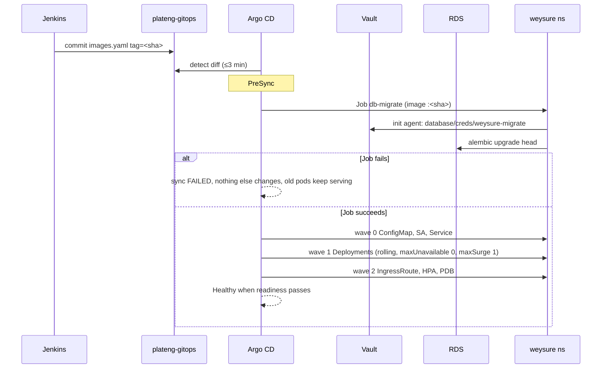

# Phase 7 — Application delivery (Weysure API + Web on EKS)

**Status:** approved design (brainstorm 2026-09-09/10), implementation pending
**Scope:** production only. Staging deferred (Adebayo, 2026-09-09).
**Inputs:** Phase 5 (RDS, Vault DB engine roles `weysure-app`/`weysure-migrate`, Redis), Phase 6 (Jenkins → ECR → `images.yaml` promote commits).

## 1. Goal

A `beyric-ci[bot]` commit to `projects/weysure/environments/prod/images.yaml` becomes a
zero-downtime rolling deployment of `weysure-api` and `weysure-web` behind Traefik at
`weysure-api.beyrictech.com` / `weysure.beyrictech.com`, with database migrations run
exactly once per release and no long-lived database password anywhere.

## 2. Decisions (agreed 1/1/1)

| # | Decision | Chosen | Rejected |
|---|---|---|---|
| D1 | Chart strategy | One in-house library chart `charts/beyric-app` in plateng-gitops; each app is a `values.yaml` | bjw-s app-template (opaque abstractions); one hand-written chart per app (drift) |
| D2 | API database credential | Vault Agent sidecar renders `/vault/secrets/env` from `database/creds/weysure-app` (1h TTL, 24h max); entrypoint sources it; pod restarts at max-TTL | ESO + Reloader (re-mint every 45 min, two live users); static user in KV (standing password) |
| D3 | Migrations | Argo CD `PreSync` Job, `alembic upgrade head`, `weysure-migrate` creds via Vault Agent init container | init container per pod (race, Finding 9) |

Also fixed: namespace `weysure`; `api` ×2, `web` ×2, `api-scheduler` ×1; PDB `minAvailable 1`;
HPA cpu 70% 2→4 (`api`, `web`); no Vault Agent on `web` (only `NEXT_PUBLIC_*` build-time
values, verified by grep — nothing secret to fetch).

## 3. Topology

```
namespace weysure
├── Deployment api            2 replicas   ecr/weysure-api:<sha>   :8000  + vault-agent sidecar
├── Deployment api-scheduler  1 replica    same image, WALLET_RECONCILIATION_SCHEDULER_ENABLED=true, no Service
├── Deployment web            2 replicas   ecr/weysure-web:<sha>   :3000
├── Service api → IngressRoute weysure-api.beyrictech.com  (TLS letsencrypt-prod)
├── Service web → IngressRoute weysure.beyrictech.com
├── Job db-migrate            PreSync hook, alembic upgrade head, weysure-migrate creds
├── ExternalSecret weysure-app-config → Secret (from kv secret/weysure/prod)
├── ConfigMap api-config / web-config (non-secret keys)
├── PDB api, web · HPA api, web · ServiceAccounts api, api-scheduler, db-migrate
└── redis (Phase 5)  REDIS_URL=redis://redis:6379/0
```

| Thing | Path | Why |
|---|---|---|
| Library chart | `plateng-gitops/charts/beyric-app/` | one implementation for every Beyric service |
| Values | `plateng-gitops/projects/weysure/environments/prod/{api,web}/values.yaml` | environment truth beside `images.yaml` |
| Argo apps | `plateng-gitops/bootstrap/apps/weysure-{secrets,api,web}.yaml` | picked up by the root app; `images.yaml` is a second `valueFiles` entry — the CI→CD contract |
| Vault roles/policies | `plateng-gitops/platform/vault/` | same mechanism as Phase 5 DB roles |
| Entrypoint change | `Weysure-API/boot/docker-run.sh` | the only developer-repo touch |

## 4. Secrets and configuration

| Key group | Source | Mechanism | In the pod |
|---|---|---|---|
| `DATABASE_URL` | `database/creds/weysure-app` (per-pod lease) | Vault Agent sidecar template → `/vault/secrets/env`; entrypoint `set -a; . /vault/secrets/env; set +a` | env var at process start |
| `SECRET_KEY`, `SMTP_*`, `EMAILS_FROM_*`, `ADMIN_NOTIFICATION_EMAILS`, `PAYSTACK_SECRET_KEY`, `PAYSTACK_PUBLIC_KEY`, `PAYSTACK_WEBHOOK_SECRET`, `CLOUDINARY_*` | `kv secret/weysure/prod` (written once by Adebayo) | ESO `dataFrom.extract` → Secret `weysure-app-config` → `envFrom`; Reloader rolls on change | env vars |
| `ENVIRONMENT`, `SERVER_HOST`, `FRONTEND_URL`, `BACKEND_CORS_ORIGINS`, `WALLET_RECONCILIATION_*`, `WEB_CONCURRENCY`, `REDIS_URL`, `RUN_MIGRATIONS=false` | chart values | ConfigMap → `envFrom` | env vars |
| `NEXT_PUBLIC_*` | Jenkinsfile build args | baked at build | n/a |

Only `SECRET_KEY` and `DATABASE_URL` are required by `Settings` (verified); `SUPABASE_*`
and `PAYSTACK_{LIVE,TEST}_*` are omitted from prod. Prod Paystack = `PAYSTACK_SECRET_KEY` /
`PAYSTACK_PUBLIC_KEY` (Adebayo, 2026-09-10).

Vault: Kubernetes auth role `weysure-api` (SAs `weysure/api`, `weysure/api-scheduler`, policy
`weysure-db-app`: read `database/creds/weysure-app`); role `weysure-migrate` (SA
`weysure/db-migrate`, policy `weysure-db-migrate`); the existing `external-secrets` role gains
read on `secret/data/weysure/prod`. The API pod cannot mint the migrate credential.

DB engine password policy pinned to URL-safe characters so the rendered `DATABASE_URL`
parses in `boot/docker-run.sh` and SQLAlchemy.

## 5. Migrations and sync ordering



- Job: `argocd.argoproj.io/hook: PreSync`, `hook-delete-policy: BeforeHookCreation,HookSucceeded`,
  `backoffLimit 0`, `activeDeadlineSeconds 600`; a failed Job stays for `kubectl logs`.
- `weysure-secrets` app syncs at an earlier wave than `weysure-api`, because `Settings()` needs
  `SECRET_KEY` even for alembic (same pattern as `ci-secrets` → `jenkins`).
- **Developer rule:** migrations must be backward-compatible with the previous image
  (expand/contract). Old pods run against the new schema for ~1 min during rollout.
- Rollback = `git revert` the promote commit. A destructive migration is not rolled back by that.

## 6. Rollout safety

| Control | api / api-scheduler | web |
|---|---|---|
| Readiness | `GET /api/v1/health` :8000, period 10 s, failure 3 | `GET /` :3000 |
| Liveness | same path, period 30 s, failure 3, initialDelay 30 | same |
| Startup | `/api/v1/health`, 30 × 5 s | — |
| Requests / limits | 250m / 512Mi → 1 CPU / 1Gi (`WEB_CONCURRENCY=2`) | 100m / 256Mi → 500m / 512Mi |
| HPA | cpu 70 %, 2→4 (not scheduler) | same |
| PDB | `minAvailable 1` | same |
| Spread | hostname, maxSkew 1, `ScheduleAnyway` | same |
| securityContext | runAsNonRoot uid 1000, readOnlyRootFilesystem + emptyDir `/tmp`, drop ALL, seccomp RuntimeDefault | uid 1001 |
| Placement | Karpenter workload nodes | same |
| Termination | grace 60 s, `preStop sleep 5` | grace 30 s, `preStop sleep 5` |

Health endpoint must stay shallow (no DB call) — liveness that touches RDS turns a DB blip into
a restart storm.

## 7. Out of scope

Staging environment; Kyverno enforcement (Phase 8); Prometheus/Grafana/alerts (Phase 9);
Linkerd; per-developer Jenkins accounts; removing Supabase code from the API.

## 8. Verification (definition of done)

1. `argocd app list` shows `weysure-secrets`, `weysure-api`, `weysure-web` Synced/Healthy.
2. `curl https://weysure-api.beyrictech.com/api/v1/health` → 200; `https://weysure.beyrictech.com` → 200 with valid cert.
3. `kubectl -n weysure get pods` → api 2/2 ×2 (agent sidecar), api-scheduler 2/2, web 1/1 ×2.
4. `SELECT usename FROM pg_stat_activity` shows short-lived `v-kubernet-weysure-…` users.
5. A merge to `Weysure-API` main → new `images.yaml` commit → `db-migrate` Job → rolling update with zero failed requests (`while curl` loop during rollout).
6. `kubectl -n weysure delete pod <api pod>` → PDB keeps one; Service never empty.
7. Revert the promote commit → previous image restored.

## 9. Well-Architected

| Pillar | How |
|---|---|
| Operational excellence | GitOps, one chart, hooks visible in Argo, SOP + runbook |
| Security | dynamic DB creds per pod, least-privilege Vault roles, non-root read-only pods |
| Reliability | PDB, spread, probes, PreSync gate, rolling maxUnavailable 0 |
| Performance | HPA on CPU, Karpenter spot scale-out |
| Cost | 5 small pods on spot; requests measured then tightened |
| Sustainability | right-sized requests; consolidation allowed on workload nodes |
