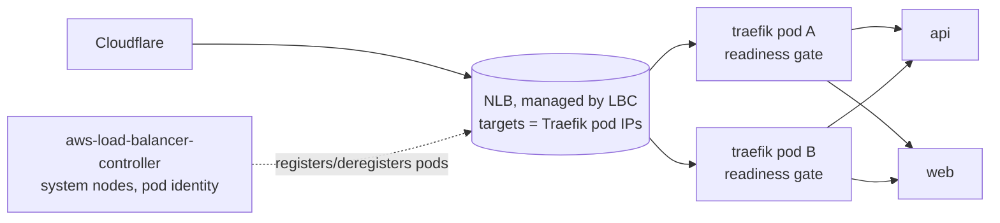

# Phase 8 — Policy, cost and edge

**Status:** design agreed 2026-09-16 (system nodes → Graviton; extended-support policy kept with an
alert). **Applies:** Adebayo. **Order:** edge first (it causes today's only availability blips),
then cost, then policy.

## 1. Goals

1. Zero failed requests during any node roll (upgrade, spot reclaim, consolidation).
2. System-node cost $140 → ~$112/mo (Graviton), no HA change.
3. Every pod in `weysure-prod` admitted only if it meets the baseline the chart already implements;
   network access in that namespace is explicit.

## 2. Decisions

| # | Decision | Chosen | Rejected |
|---|---|---|---|
| D1 | NLB integration | **AWS Load Balancer Controller**, `nlb-target-type: ip` (targets are Traefik pods), pod readiness gates | keep in-tree controller (cannot update the NLB — Finding ㊴); node targets |
| D2 | System nodes | **2× m7g.large (Graviton, arm64)** via a second node group, blue/green | one node + Karpenter fallback (platform outage on node loss); Savings Plan now (12-month commitment before steady state is known) |
| D3 | Extended-support policy | keep `EXTENDED`; alert 60 days before 2027-08-02 (Phase 9 rule + calendar) | `STANDARD` auto-upgrade |
| D4 | Redis disruption | `karpenter.sh/do-not-disrupt: "true"` on the pod | PDB (blocks drains at one replica — Finding ㊲) |
| D5 | Admission policy | **Kyverno** 3.x; Audit cluster-wide for 7 days, then **Enforce in `weysure-prod` only**; platform namespaces stay Audit | Pod Security Admission (no custom rules, no reports); Enforce everywhere (Kaniko/Jenkins agents need root) |
| D6 | Network policy | VPC CNI network-policy mode + default-deny in `weysure-prod` with explicit allows | Calico (second CNI); Linkerd (deferred, Phase 10) |
| D7 | Quotas | `ResourceQuota` + `LimitRange` in `weysure-prod` | none |

arm64 verified 2026-09-16: every image on the system nodes publishes `linux/arm64` (Jenkins,
Traefik, Vault + injector, Argo CD, cert-manager ×3, ESO, Reloader, external-dns, metrics-server,
Karpenter, Redis); EKS-managed addons are multi-arch by AWS. SonarQube runs on workload nodes
and is not affected.

## 3. Edge — AWS Load Balancer Controller

- Terraform: IAM policy (upstream `iam_policy.json` for the chart version) + pod-identity
  association for SA `kube-system/aws-load-balancer-controller`.
- gitops: chart `aws-load-balancer-controller` (eks-charts), 2 replicas on system nodes, wave 3.
- Traefik Service annotations: `service.beta.kubernetes.io/aws-load-balancer-type: external`,
  `aws-load-balancer-nlb-target-type: ip`, `aws-load-balancer-scheme: internet-facing`,
  `aws-load-balancer-healthcheck-path: /ping`; namespace label
  `elbv2.k8s.aws/pod-readiness-gate-inject: enabled`.
- Cut-over: LBC creates a **new** NLB; Traefik publishes the new hostname; external-dns updates
  Cloudflare (proxied → edge switches immediately). The legacy NLB is orphaned by design and deleted
  by hand after 24 h clean. The eks module's duplicate `kubernetes.io/cluster/…` tag on the node SG
  becomes irrelevant (LBC manages its own SGs for ip targets).
- Proof: probe (1 req/2 s) through a Traefik rollout and a `kubectl drain` of one system node:
  **0 non-200**.

## 4. Cost — Graviton system nodes

- Terraform: add `eks_managed_node_groups.system_arm` — `m7g.large`, `AL2023_ARM_64_STANDARD`,
  min/desired/max 2, label `node-role: system`, taints none. Apply → 4 system nodes.
- Cut-over (Adebayo): `kubectl cordon` + `kubectl drain --ignore-daemonsets --delete-emptydir-data`
  the two x86 nodes, one at a time; pods reschedule onto arm64 (PDBs respected; Vault ~1–2 min).
- Terraform: remove the x86 group. Apply.
- Rollback: reverse the drain (keep the x86 group until 24 h clean).

## 5. Policy — Kyverno

Policies (ClusterPolicy, `validationFailureAction: Audit` first): `disallow-latest-tag`,
`require-requests-limits`, `require-run-as-nonroot`, `require-ro-rootfs`,
`drop-all-capabilities`, `restrict-seccomp` (RuntimeDefault), `disallow-host-namespaces`,
`disallow-privileged`. After 7 days with `kubectl get policyreport -n weysure-prod` clean:
`Enforce` scoped by namespace selector to `weysure-prod`. Exceptions (`PolicyException`) recorded
with rationale — expected: Jenkins agent pods (Kaniko root), Vault Agent init (uid 100 in Jobs).

## 6. Network — default deny in `weysure-prod`

Terraform: vpc-cni addon `configuration_values = { enableNetworkPolicy = "true" }`.
gitops `projects/weysure/environments/prod/network/`:

| Policy | Allows |
|---|---|
| `default-deny` | nothing in, nothing out (selects all pods) |
| `allow-dns` | egress UDP/TCP 53 to `kube-system` |
| `api-ingress` | api ← `traefik` namespace :8000 |
| `web-ingress` | web ← `traefik` :3000 |
| `api-egress` | api, api-scheduler, db-migrate → RDS (VPC CIDR :5432), redis :6379, `vault` ns :8200, internet :443/:587 (Paystack, Cloudinary, SMTP) |
| `redis-ingress` | redis ← api, api-scheduler |

Ordered: allows first, `default-deny` last; probe both hosts between each apply.

## 7. Quotas

`ResourceQuota` weysure-prod: requests.cpu 4, requests.memory 8Gi, limits.cpu 8, limits.memory 12Gi,
pods 30. `LimitRange`: default request 100m/128Mi, default limit 500m/512Mi (only for pods that
omit them — the chart always sets them).

## 8. Out of scope

Linkerd/mTLS (Phase 10); Savings Plan (revisit after Phase 9 metrics); Karpenter arm64 for
workload nodes (app images are amd64-only today — Jenkins builds on amd64 agents).

## 9. Definition of done

LBC owns the NLB, probe 0 non-200 through a drain · 2× m7g.large, x86 group gone, all platform
pods Running on arm64 · Kyverno Enforce in `weysure-prod`, `policyreport` clean, exceptions
documented · NetworkPolicies applied, both hosts 200, Paystack webhook test delivered · quotas
present · cost run-rate ≈ $11/day · SOP, diagram, checklist.

## 10. Well-Architected delta

Reliability (readiness-gated targets, disruption guard) · Security (admission baseline, default
deny, least-privilege LBC role) · Cost (Graviton −20 %) · Sustainability (arm64 perf/watt) ·
Operational excellence (policy as code, reports) · Performance (pod-IP targets, one hop fewer).
