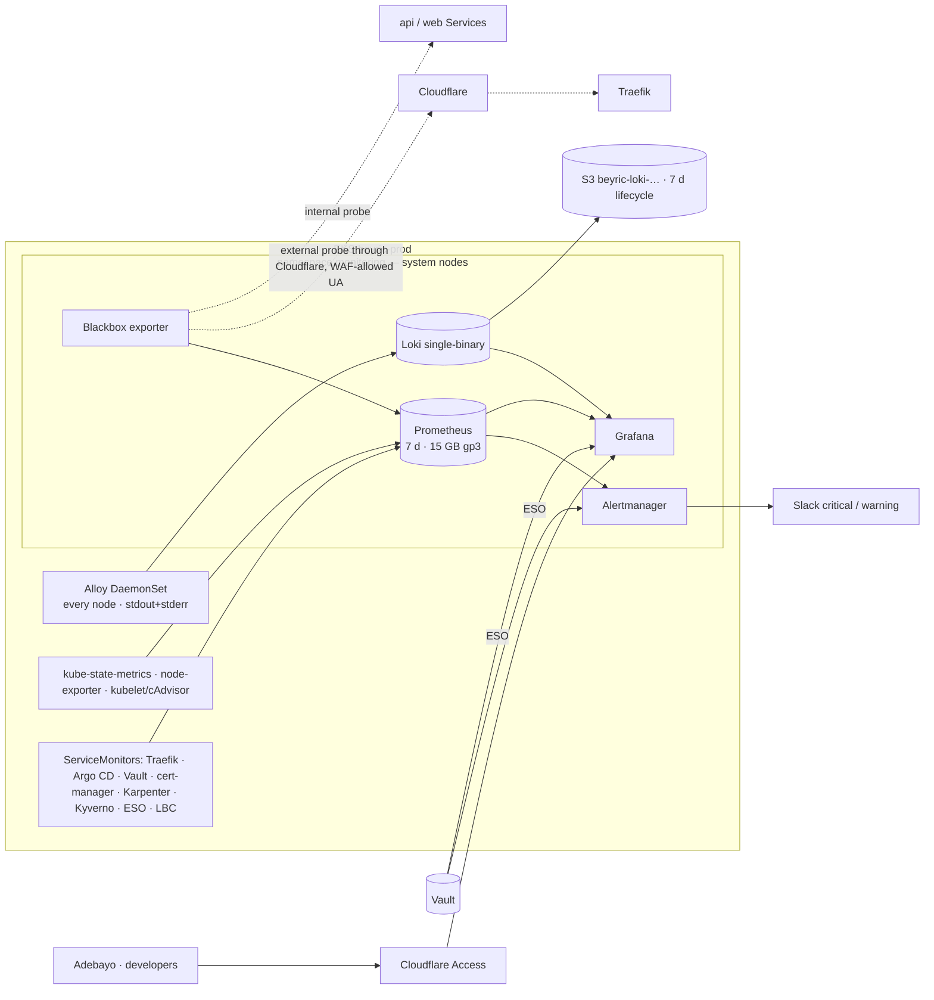

# Phase 9 — Observability

**Status:** design agreed 2026-09-21 (four decisions, one question at a time). **Applies:** Adebayo
(`terraform apply`, Cloudflare and Slack consoles). Sentry is left to the developers.

## 1. Goals

1. Know the sites are down **before a user says so**, from outside (through Cloudflare) and inside.
2. Answer "what changed / what is slow / what is failing" from dashboards and logs, not `kubectl`.
3. Every alert reaches Slack with a runbook link; nothing pages that a human cannot act on.
4. Costs ≤ ~$20/month and survives sleep mode.

## 2. Decisions

| # | Decision | Chosen | Rejected |
|---|---|---|---|
| D1 | Where metrics/logs live | In-cluster **kube-prometheus-stack 91.4.1** (Prometheus, Alertmanager, Grafana), **Blackbox 11.18.0**, **Loki 7.3.0** single-binary on S3, **Alloy 1.12.1** collector | Grafana Cloud free (10k-series cap, third party); AMP+AMG (cost, least transferable) |
| D2 | Alert routing | **Slack**, `#beyric-alerts-critical` and `#beyric-alerts-warning`; webhooks in Vault `secret/platform/alertmanager` (stored 2026-09-21) | email (missed), PagerDuty (overkill solo) |
| D3 | Retention | **7 d metrics on 15 GB gp3, 7 d logs** — expandable online (`allowVolumeExpansion: true`); revisit at go-live | 15 d / 30 d now |
| D4 | Grafana access | `grafana.beyrictech.com` behind **Cloudflare Access** (Zero Trust, free ≤ 50 users) **and** Grafana validates the Access JWT | public + Grafana login; port-forward only |

**D4 detail — why both halves.** Cloudflare Access guards the *edge*; the NLB behind it is public, so
a request sent straight to the NLB with the right `Host` header would skip Access. Grafana therefore
trusts only a valid `Cf-Access-Jwt-Assertion` (`[auth.jwt]`, `jwk_set_url =
https://<team>.cloudflareaccess.com/cdn-cgi/access/certs`, `email_claim = email`, `auto_sign_up`,
login form disabled). Result: single sign-on through Access, and a direct-to-origin request gets 401.
Roles: Adebayo Admin, developers Viewer (by email). Jenkins and Sonar move behind Access in Phase 10.

## 3. Architecture

- **Placement:** Prometheus, Alertmanager, Grafana, Loki, Blackbox on the **system nodes** (on-demand;
  monitoring must not die with a spot reclaim). Fits: system nodes run at ~35 % memory today.
  Alloy, node-exporter are DaemonSets on every node.
- **Storage:** Prometheus 15 GB, Alertmanager 1 GB, Grafana 2 GB (gp3). Loki chunks/index in S3
  bucket `beyric-loki-767397877316` (Terraform; SSE, block public access, 7-day lifecycle); Loki pod
  identity role scoped to that bucket.
- **Secrets:** Slack URLs and Grafana admin password from Vault via ESO (`monitoring` namespace
  added to the ClusterSecretStore's scope if needed). Nothing in git.
- **Network/policy:** `weysure-prod` default-deny gains one ingress allow: `monitoring` namespace →
  api :8000 (`/metrics` if the app exposes one; Blackbox probe) and web :3000. Kyverno stays Audit
  in `monitoring` (node-exporter needs hostNetwork/hostPID by design).
- **Cloudflare WAF:** Blackbox's external probe uses a browser-like `User-Agent` (Finding: the WAF
  403s library UAs). If still challenged: one WAF skip rule for a secret header value (in Vault).

## 4. What is scraped

Kubernetes (kubelet, cAdvisor, kube-state-metrics, node-exporter, API server) · Traefik (requests,
latency, 5xx by service) · Argo CD (app health/sync) · Vault (`sys/metrics`, sealed, leases) ·
cert-manager (expiry) · Karpenter (nodeclaims, disruptions) · Kyverno (admission results) · ESO
(sync status) · AWS LBC · Blackbox (HTTP 2xx, TLS expiry, DNS) · RDS via CloudWatch **alarms**
(not an exporter — 3 alarms → SNS → Slack is cheaper than YACE).
Application metrics (`/metrics` from FastAPI) are a **developer follow-up** with Sentry.

## 5. Alerts (initial set; each links to a runbook section)

| Alert | Severity | Condition |
|---|---|---|
| SiteDownExternal / SiteDownInternal | critical | Blackbox probe fails 2 min (api, web) |
| TLSCertExpiringSoon | warning 14 d · critical 3 d | probe or cert-manager expiry |
| VaultSealed / VaultDown | critical | sealed or no scrape 2 min |
| ArgoAppDegraded / ArgoAppOutOfSync | warning | > 15 min (ignores known cosmetic: LBC, root) |
| PodCrashLooping / JobFailed (weysure-prod) | warning | restarts > 3 in 15 min · failed Job |
| DeploymentReplicasMismatch (api, web) | critical | available < desired 10 min |
| Traefik5xxRate | warning > 2 % · critical > 10 % | 5 min, per service |
| NodeNotReady / NodeMemoryPressure / DiskFilling | warning | kubelet conditions · PVC > 80 % |
| KarpenterChurn | warning | > 6 node disruptions / hour (seen 2026-09-19/21) |
| VaultLeaseAnomaly | warning | expired-unrevoked leases > 0 (Finding 41) |
| ESOSyncFailed | warning | ExternalSecret not Ready 15 min |
| RDS CPU > 80 % · FreeStorage < 2 GB · Connections > 80 % | warning | CloudWatch alarms |
| EKSEndOfStandardSupport | warning | static rule fires from **2027-06-03** (60 d before 2027-08-02) |
| Watchdog (always firing) | — | dead-man's switch: if it stops arriving, monitoring is down |

Inhibit: NodeNotReady silences pod-level alerts on that node. Sleep mode: run
`amtool silence add` for 12 h from `platform-sleep.sh` (added in this phase), so going to sleep
does not fill Slack.

## 6. Dashboards (provisioned from git)

Cluster overview · Node/pod resources · **Weysure service** (requests, latency, 5xx, restarts,
HPA, DB connections from Vault users) · Traefik · Argo CD · Vault · cert/TLS expiry · Blackbox
uptime (30-day SLO view once retention allows) · Karpenter · Logs explorer (Loki).

## 7. Open investigations this phase closes

Unexplained extra Vault credential render (2026-09-18) · probe blips seen only from one laptop
(in-cluster vs external Blackbox settles it) · Karpenter "Underutilized" churn → tune
`consolidateAfter` with data · platform charts without requests/limits (Kyverno audit).

## 8. Cost

~+$5/mo EBS (18 GB) · S3 pennies · system nodes absorb the pods (no new node expected;
if Karpenter adds one for Loki/Prometheus memory: ~+$12/mo spot). Cloudflare Access and Slack: $0.

## 9. Definition of done

Both Blackbox probes green and a deliberate failure (scale web to 0 for 3 min — Adebayo) reaches
`#beyric-alerts-critical` within 3 min and resolves · Grafana reachable only through Access
(direct-to-NLB request → 401) · developers see dashboards as Viewer · api stdout **and stderr**
searchable in Loki (developer handover item 5) · Watchdog arriving · sleep → no alert storm ·
SOP, runbook `ALERTS.md` (one section per alert), checklist, overview updated.

## 10. Out of scope

Tracing (Tempo/OTel) · application metrics and Sentry (developers) · long-term metrics (Thanos/Mimir)
· Access in front of Jenkins/Sonar (Phase 10) · on-call rotation.

## 11. Well-Architected delta

Operational excellence (dashboards, runbook-linked alerts, dead-man's switch) · Reliability
(external + internal probing, replica and cert alerts) · Security (Access + JWT validation at
origin, secrets from Vault) · Cost (7-day retention, CloudWatch alarms over an exporter) ·
Performance (latency/5xx per service) · Sustainability (right-sizing data from real usage).
