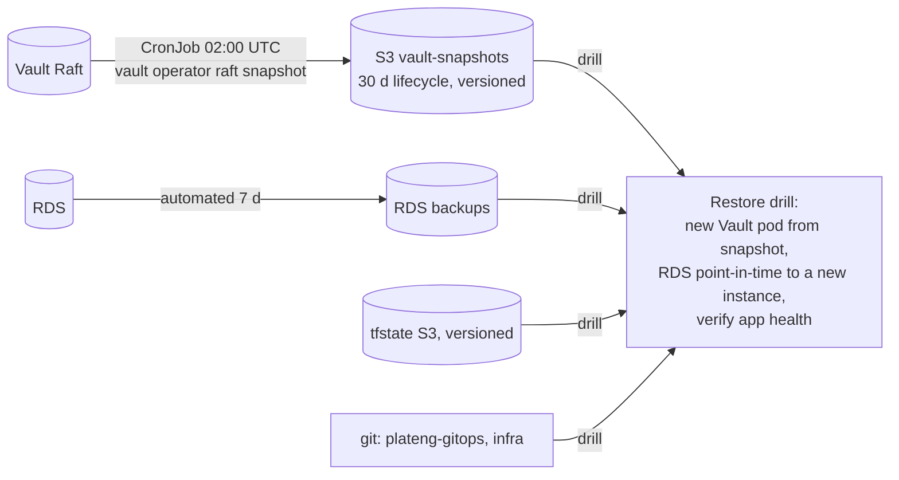

# Phase 10 — Hardening and disaster recovery

**Status:** design agreed 2026-09-23 (D1 backups, D2 edge logins). **Applies:** Adebayo. Closes the
build; what remains after it is operation.

## 1. Goals

1. Any single loss — a Vault volume, the RDS instance, a system node, a bad release — is recoverable
   from a written procedure that has been **rehearsed once**.
2. Every platform UI is behind the same login as Grafana; nothing on the public NLB accepts a
   password of its own.
3. The two capacity findings from Phase 9 are fixed, and the platform is fully described by git plus
   Terraform (no hand-typed Vault config).

## 2. Decisions

| # | Decision | Chosen | Rejected |
|---|---|---|---|
| D1 | Backups | **RDS automated backups 7 d** (already on: window 03:00–04:00 UTC, deletion protection, encrypted) + **daily Vault Raft snapshot** CronJob → `beyric-vault-snapshots-…` (bucket exists, **0 objects today** — the Phase 3 CronJob was never written) + **quarterly restore drill** | cross-region copies (later, when there are users); RDS-only |
| D2 | Edge logins | **Cloudflare Access on jenkins/sonar/prometheus/alertmanager** with a **Traefik forward-auth middleware** that validates the Access JWT at the origin (same guarantee as Grafana); Jenkins/Sonar local logins stay as a second factor behind it | Access at the edge only (NLB bypass); status quo |
| D3 | Pod capacity | **VPC CNI prefix delegation** (29 → 110 pods per m7g.large); node group rolled once under the LBC | bigger nodes; a third system node |
| D4 | Prometheus cardinality | drop Karpenter's `instance_type_offering_*` series (49 k of 225 k) via `metricRelabelings` | bigger Prometheus |
| D5 | Vault config as code | Terraform `vault` provider manages policies, Kubernetes auth roles, database roles (import the live objects, no recreation) | keep the runbook only |
| D6 | Argo hygiene | `ignoreDifferences` for the LBC/root webhook-cert diff; Vault chart config checksum annotation (Finding ㉖ recurrence) | live with cosmetic OutOfSync |
| D7 | Sleep | healthchecks pause/resume from the scripts; rehearse the fixed sleep/wake once | — |

## 3. Backups and restore

- **Vault snapshot CronJob** (gitops `platform/vault/snapshot-cronjob.yaml`): Kubernetes-auth role
  `vault-snapshot` with a policy allowing `sys/storage/raft/snapshot`; `vault operator raft snapshot
  save` → `aws s3 cp` via pod identity (Terraform role scoped to the bucket). Baseline-compliant pod.
  The snapshot is encrypted at rest by KMS auto-unseal: **losing the KMS key makes every snapshot
  unreadable** — the key has rotation on and no deletion scheduled; add a CloudWatch alarm on
  `ScheduleKeyDeletion`.
- **Restore drill** (runbook `RESTORE_DRILL.md`, run once now, then quarterly): restore the latest
  snapshot into a scratch Vault (`vault operator raft snapshot restore -force` on a fresh single pod
  in a `vault-drill` namespace) and read one known key; RDS **point-in-time restore to a new
  instance** `weysure-postgres-drill`, run `alembic current` against it, delete it. Both must be
  scripted so the drill is an hour, not a day.
- Retention: Vault snapshots 30 days (lifecycle), RDS 7 days (raise to 14 at go-live).

## 4. Edge logins

- Cloudflare Access applications for `jenkins`, `sonar`, `prometheus`, `alertmanager` hostnames
  (`beyric-team` policy: Adebayo; Jenkins/Sonar also the developer).
- Traefik `Middleware` **forwardAuth** → a small verifier (`cloudflare-access-jwt-verify`, or Traefik's
  ForwardAuth against a 30-line service) that checks `Cf-Access-Jwt-Assertion` against the team JWKS
  and the per-app AUD; applied to the four Ingresses. Direct-to-NLB → 401, like Grafana.
- Prometheus and Alertmanager get Ingresses **only** with that middleware in place.
- Jenkins **webhooks** from GitHub must bypass Access: an Access *service token* or a bypass rule for
  `/github-webhook/` from GitHub's IP ranges — verified by a real push before the switch.

## 5. Capacity, cardinality, hygiene

- Prefix delegation: `configuration_values.env.ENABLE_PREFIX_DELEGATION = "true"` on the vpc-cni
  addon, node group `max_pods` via the module's bootstrap args, roll the group (LBC keeps probes at 0
  failures). Verify `kubectl get node -o jsonpath={.status.allocatable.pods}` → 110.
- Karpenter ServiceMonitor `metricRelabelings`: drop `karpenter_cloudprovider_instance_type_offering_.*`.
- `ignoreDifferences` on `aws-load-balancer-controller` and `root`; Vault `server.annotations`
  `checksum/config` from the values.

## 6. Vault config as code

Terraform `vault` provider (token from Secrets Manager admin creds at plan time, via the
`beyric-admin` session — never stored): `vault_policy` ×5, `vault_kubernetes_auth_backend_role` ×4,
`vault_database_secret_backend_role` ×2, `vault_kv_secret_backend_v2` mount. Everything **imported**
first (`terraform import`), plan must show **0 to add/change/destroy** before the runbook
`VAULT_CONFIG.md` is retired. Secrets (KV values) stay out of Terraform.

## 7. Definition of done

A Vault snapshot in S3 every day (alert `VaultSnapshotMissing` if > 26 h old) · restore drill executed
and timed, runbook updated with the timings · jenkins/sonar/prometheus/alertmanager reachable only
through Access, direct-to-NLB 401, GitHub webhook still triggers builds · system nodes at 110 pods,
KubeletTooManyPods gone · Prometheus series < 180 k · Argo shows 0 OutOfSync at rest · `terraform plan`
for Vault config = no changes · one full sleep/wake rehearsal with the fixed scripts, healthchecks quiet.

## 8. Out of scope

Multi-region, Linkerd/mTLS, staging environment, Savings Plan (after a month of metrics), tracing.
